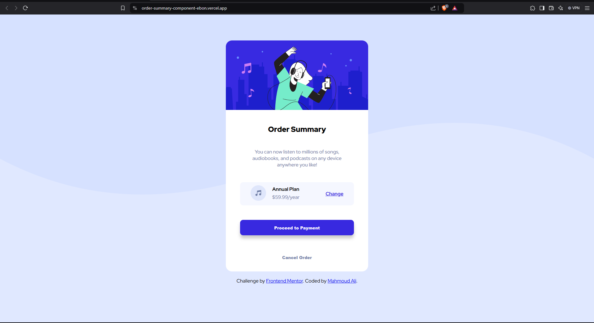

# Frontend Mentor - Order summary card solution

This is a solution to the [Order summary card challenge on Frontend Mentor](https://www.frontendmentor.io/challenges/order-summary-component-QlPmajDUj). Frontend Mentor challenges help you improve your coding skills by building realistic projects. 

## Table of contents

  - [Screenshot](#screenshot)
  - [Links](#links)
  - [Built with](#built-with)
  - [Author](#author)

### Screenshot

### Links

- Solution URL: [solution](https://github.com/mahmoud-abo-al-ela/Frontend-Mentor/tree/main/order-summary-component])
- Live Site URL: [live URL](https://your-live-site-url.com](https://order-summary-component-ebon.vercel.app/]))

### Built with

- Semantic HTML5 markup
- CSS custom properties
- Mobile-first workflow

## Author

- Website - [Mahmoud Ali](https://www.your-site.com](https://mahmoud-ali-portfolio.netlify.app/))
- Frontend Mentor - [@mahmoud-abo-al-ela](https://www.frontendmentor.io/profile/mahmoud-abo-al-ela)
- Linkedin - [Mahmoud Ali](https://www.linkedin.com/in/mahmoud-abo-al-ela/)
